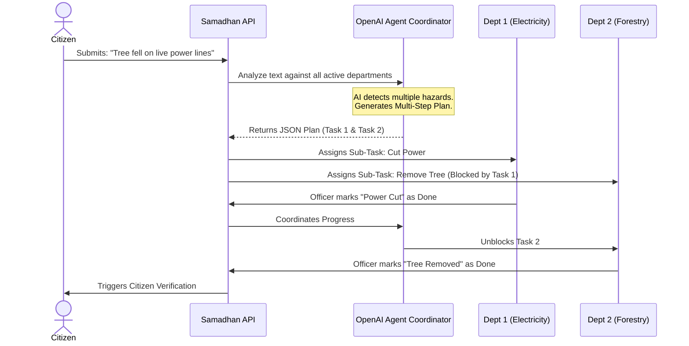

<div align="center">
  <h1>🏛️ Samadhan - Agentic AI Grievance Resolution</h1>
  <p><strong>National Public Grievance Redressal & Autonomous Workforce Management System</strong></p>
  <p><i>Built to solve PS3: Agentic Decision Support for Complex Public Grievances</i></p>
</div>

<br />

**Samadhan** is a highly scalable, secure, and intelligent platform designed to bridge the gap between citizens and government officials. Moving beyond traditional "register and forward" complaint systems, Samadhan utilizes an **Agentic AI Coordinator** to actively analyze, plan, and manage the resolution of complex, multi-departmental public grievances.

---

## 📑 Table of Contents
1. [Hackathon Problem Statement (PS3)](#-hackathon-problem-statement-ps3)
2. [How the Agentic AI Works](#-how-the-agentic-ai-works)
3. [Core Architecture & Technologies](#-core-architecture--technologies)
4. [Hierarchical RBAC Architecture](#-hierarchical-rbac-architecture)
5. [Key Features](#-key-features)
6. [Security & Accountability](#-security--accountability)
7. [Installation & Local Setup](#-installation--local-setup)

---

## 🎯 Hackathon Problem Statement (PS3)
**The Challenge:** Traditional grievance systems fail when a single issue involves multiple departments, incomplete information, or sequential actions (e.g., A storm knocks down a tree onto power lines). 

**The Samadhan Solution:** 
We built an autonomous **Agentic Decision Support System**. Instead of acting as a simple chatbot or text classifier, the AI acts as a digital project manager. It:
- **Understands Context:** Reads the grievance and identifies if multiple departments are needed.
- **Multi-step Planning:** Breaks the grievance down into a sequence of actionable sub-tasks.
- **Dependency Tracking:** Ensures Task B (removing a tree) doesn't start until Task A (cutting live power) is completed.
- **Human Escalation:** Autonomously flags and escalates issues to human supervisors if tasks are blocked or information is missing.

---

## 🤖 How the Agentic AI Works

When a complex complaint is submitted, the system bypasses standard routing and triggers the `agenticCoordinator.js` pipeline:



---

## 🛠 Core Architecture & Technologies

Samadhan is built on a robust MERN stack, enhanced with AI processing, real-time bidirectional communication, and geospatial tracking.

- **Frontend:** React 18, React Router DOM, Lucide Icons, Leaflet (Geospatial Mapping).
- **Backend:** Node.js, Express.js.
- **Database:** MongoDB & Mongoose (utilizing `2dsphere` indexes for geographic coordinate querying).
- **Real-Time Engine:** Socket.io (for instant grievance alerts and auto-updating UI).
- **AI Engine:** OpenAI `gpt-4o` for Agentic Task Planning and Sentiment Analysis.
- **Security:** JWT Authentication, bcrypt, express-rate-limit, Role-Based Access Control (RBAC).

---

## 👑 Hierarchical RBAC Architecture

Samadhan enforces strict data-partitioning and mutation boundaries based on roles. A major feature of the Agentic AI integration is that officers can securely interact with specific *sub-tasks* belonging to their department, without gaining unauthorized access to the rest of the system.

- **Super Admin (National):** Macro-view of the entire nation.
- **State Admin / Chief Minister (CM):** Oversees Departments, Employees, and Citizens within their registered state.
- **Department Head:** Manages Employees and analytics specifically within their department (e.g., Water Board).
- **Employee / Officer:** The boots-on-the-ground worker. Can claim and execute AI-assigned sub-tasks.
- **Citizen:** Submits grievances and acts as the ultimate verifier of resolution.

---

## ✨ Key Features

### 📍 Geospatial Mapping & Geo-Fence Tracking
Citizens drop pins on a live map to report issues. When an officer attempts to mark a complaint as "Resolved," the system triggers a **Geo-Fence check**. If the officer is more than 300 meters away from the actual incident location, the system throws a "Geo-Fence Violation" alert to prevent fraudulent closures.

### 🛑 Anti-False Closure & Citizen Verification
The lifecycle of a complaint guarantees accountability. When all Agentic sub-tasks are completed, the system does **not** close the ticket. It moves to a `pending_verification` state. The citizen receives an alert and must physically confirm the real-world issue is resolved. If they reject it, the system logs a "False Closure" against the officer and escalates the ticket.

### 🧠 Auto-Assignment via Workload Balancing
The backend actively tracks how many active complaints an officer has versus their maximum bandwidth. When a new sub-task is created by the AI, the first available employee in the relevant department who clicks "Start" is securely assigned ownership of that task.

---

## 🔒 Security & Accountability

Given the sensitive nature of government data, Samadhan employs strict architectural guardrails:

1. **Sub-Task Level Authorization:** The API actively intercepts cross-department task modification. An employee in the Water Department is cryptographically blocked from clicking "Done" on an Electricity Department sub-task.
2. **Immutable Audit Logging:** Every verified action, AI plan generation, and false-closure detection creates an immutable record in the `AuditLog` collection.
3. **Graceful AI Degradation:** If the Agentic AI encounters a catastrophic failure or API timeout, the backend gracefully falls back to standard single-department routing, ensuring citizens can always submit emergencies.

---

## 🚀 Installation & Local Setup

### 1. Prerequisites
- **Node.js** (v18.x or higher)
- **MongoDB** (Local instance running on `localhost:27017` or Atlas URI)
- **OpenAI API Key** (Required for the Agentic Coordinator)

### 2. Backend Setup
Navigate to the backend directory, install dependencies, and configure your environment.
```bash
cd backend
npm install

# Create environment configuration
echo "PORT=5000" > .env
echo "MONGO_URI=mongodb://localhost:27017/samadhan" >> .env
echo "JWT_SECRET=your_super_secret_jwt_key" >> .env
echo "OPENAI_API_KEY=sk-your-openai-api-key" >> .env

# Start the Express server
npm run dev
```

### 3. Frontend Setup
Open a new terminal, navigate to the frontend directory, install dependencies, and start the React app.
```bash
cd frontend
npm install

# Start the React development server
npm start
```
The application will spin up at `http://localhost:3000`.

---
<div align="center">
  <i>Built to modernize and secure public grievance redressal infrastructure.</i>
</div>
